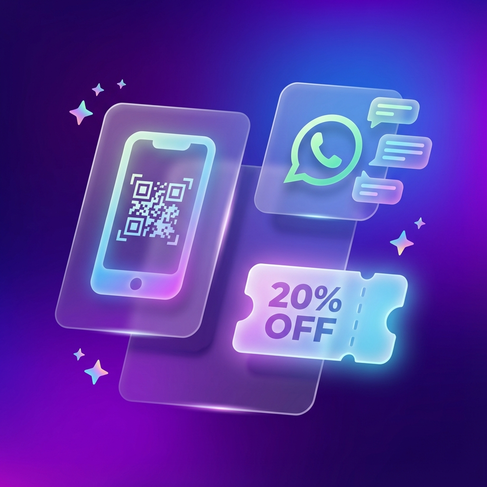
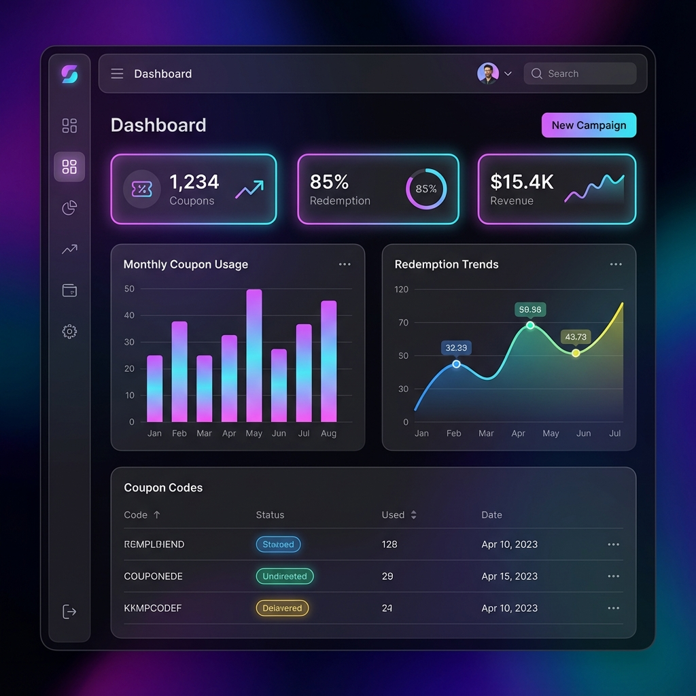
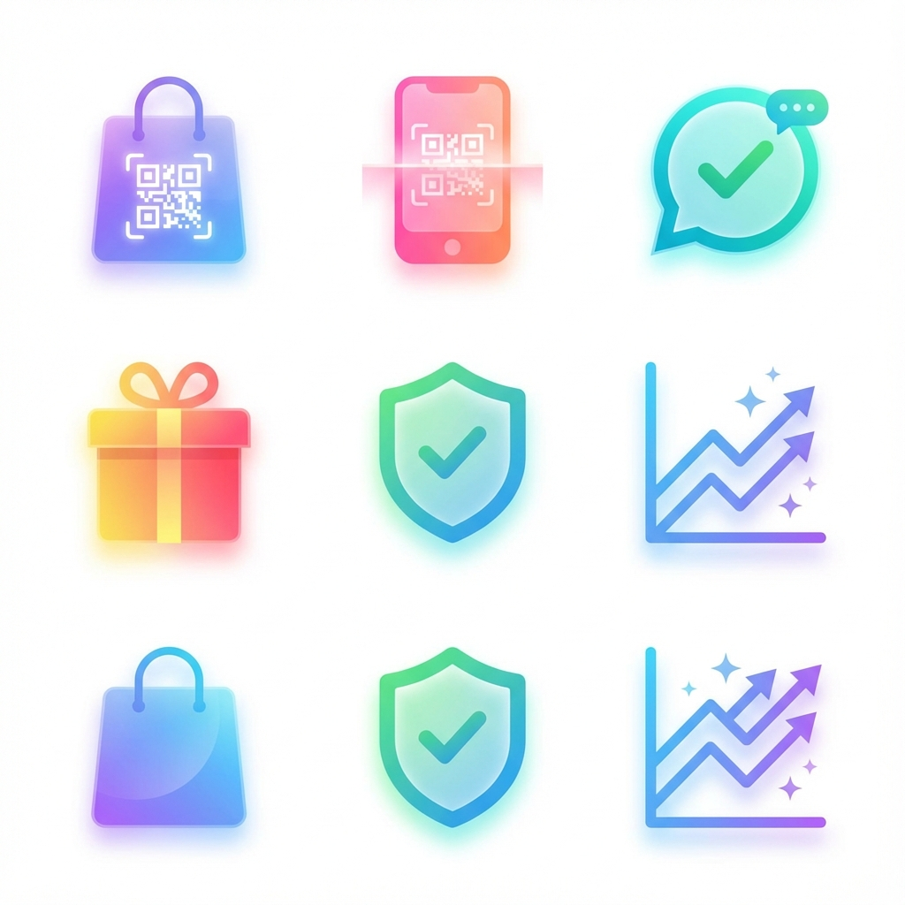

# 🎟️ QR Coupon System



<div align="center">

[](https://reactjs.org/)
[](https://vitejs.dev/)
[](https://www.framer.com/motion/)
[](./LICENSE)

**A modern, animated, and secure WhatsApp-based Coupon Automation System.**

[View Demo](#-demo) • [Features](#-features) • [Getting Started](#-getting-started) • [Screenshots](#-screenshots)

</div>

---

## 💡 About The Project

The **QR Coupon System** is a cutting-edge solution designed to automate customer loyalty programs. By leveraging WhatsApp and QR codes, it provides a seamless experience for both businesses and customers.

**Key capabilities:**
*   **Instant Coupon Generation:** Customers receive unique QR coupons via WhatsApp after purchase.
*   **Dual-Role Access:** Dedicated dashboards for **Admins** (analytics, management) and **Cashiers** (redemption, scanning).
*   **Smart Tracking:** Prevents misuse with unique, one-time-use codes.
*   **Visual Excellence:** Built with a premium glassmorphism aesthetic, dark mode, and fluid animations.

## ✨ Features

### 🎨 Modern & Animated UI
*   **Glassmorphism Design:** Sleek, translucent elements with vibrant gradients.
*   **Dark Mode:** Beautifully crafted dark theme with a custom animated toggle (Sun/Moon/Stars).
*   **Micro-interactions:** Delightful hover effects and smooth page transitions using Framer Motion.

### 🔐 Secure & Role-Based
*   **Admin Dashboard:** Comprehensive analytics, user management, and reporting.
*   **Cashier Dashboard:** Fast QR scanning and coupon verification interface.
*   **Protected Routes:** Secure navigation ensures users only access authorized areas.

### 📱 Responsive & Accessible
*   **Mobile-First:** Perfectly optimized for all devices, from phones to desktops.
*   **Accessibility:** Designed with contrast and screen readers in mind.

## 📸 Screenshots

### Admin Dashboard


### Feature Highlights


## 🚀 Getting Started

Follow these steps to set up the project locally.

### Prerequisites
*   Node.js (v16+)
*   npm or yarn

### Installation

1.  **Clone the repository**
    ```bash
    git clone https://github.com/yourusername/qr-coupon-system.git
    cd qr-coupon-system
    ```

2.  **Install dependencies**
    ```bash
    npm install
    ```

3.  **Run the development server**
    ```bash
    npm run dev
    ```

4.  **Open in Browser**
    Visit `http://localhost:5173` to see the app in action.

## 🔐 Demo Credentials

Use these credentials to explore the system:

| Role | Email | Password |
|------|-------|----------|
| **Admin** | `admin@demo.com` | `demo123` |
| **Cashier** | `cashier@demo.com` | `demo123` |

## 🛠️ Tech Stack

*   **Frontend:** React, Vite
*   **Styling:** CSS3 (Variables, Glassmorphism), Lucide React (Icons)
*   **Animation:** Framer Motion
*   **Routing:** React Router DOM
*   **State Management:** React Context API

## 🤝 Contributing

Contributions are welcome! Please feel free to submit a Pull Request.

1.  Fork the Project
2.  Create your Feature Branch (`git checkout -b feature/AmazingFeature`)
3.  Commit your Changes (`git commit -m 'Add some AmazingFeature'`)
4.  Push to the Branch (`git push origin feature/AmazingFeature`)
5.  Open a Pull Request

## 📄 License

Distributed under the MIT License. See `LICENSE` for more information.

---

<div align="center">
  <p>Built with ❤️ using the MERN Stack</p>
</div>
